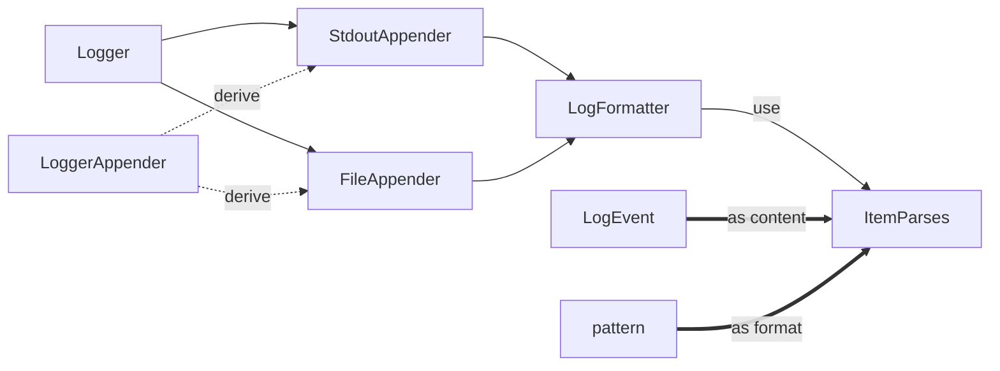
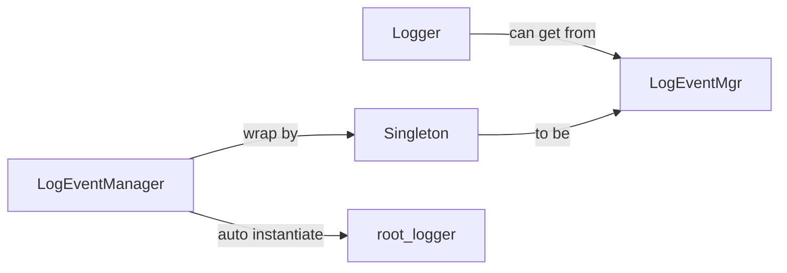
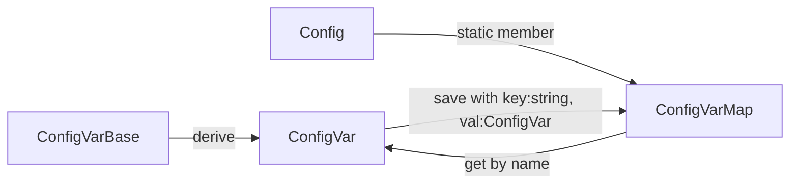
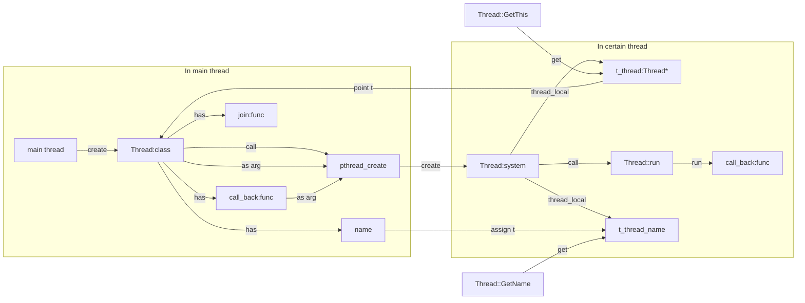

# YECC Server
---
## 1. Logger
- output logs to console or files
- set log level(both logger and loggerAppender), they will filter out logs with lower LogLevel

**Logger struct as follow:**



**How YECC_LOG_DEBUG works:**
- Create LogEvent(anonymous instance) with YECC_LOG_DEBUG
- LogEvent destruct instantly
- Call destructor function automally
- In destructor, call log
  ```cpp
  LogEventWrap::~LogEventWrap(){
    m_logEvent->getLogger()->log(m_logEvent->getLevel(), m_logEvent);
  }
  ```
- Use `LogEventWarp` because if not do so, we must use `shared_from_this` in destructor, and will cause `Bad weak ptr error`

**LogEventManager and LogEventMgr**
- `LogEventManager` manager all loggers and can get them by name, it will instantiate a logger (`m_root`) automally
- use `LogEventMgr` to make sure that `LogEventManager` is singleton

**New Logger**
when create a new logger but not set appender, new logger will still use root_logger to log(`Logger::m_root->log()`)
  
**About pattern:**
|code|meaning|code|meaning|
|----|----|----|----|
|%m|message|%p|log level|
|%c|logger name|%t|thread ID|
|%n|Enter|%d|time|
|%f|current file name|%l|line number|

## 2. Config
- parse config with yaml-cpp

**About Yaml**
```yaml
logs:
  - name: root
    level: info
    formatter: "%d%T%m%n"
    appender:
      - type: FileLogAppender
        file: log.txt
      - type: StdoutLogAppender
```
- '\-' means Sequence(lot of objects)
- 'name : val' means property of an object
- '\- 123' yaml also can save base data type directly(without property name) 

**About Yaml API**
`YAML::Node` was the core struct of yaml-cpp. You can get vars as Map/Seq/Scalar... from Node, but only the matched data type can get. 
Example
```yaml
vec:
  - 1
  - 2
  - 3
```
```cpp
for(int i=0; i<node[i].size(); i++) {
  cout<<node[i].Scalar();
}
```
It will output: 1, 2, 3
But if in this case:
```yaml
vec:
  - xx: 1
  - yy: 2
  - zz: 3
```
It will output **nothing**, because each node[i] is ==Map==, not Scalar, so, although you can call Scalar(), nothing you can get.
You can get value as:
```cpp
for(int i=0; i<node[i].size(); i++) {//Seq iter
  for(auto& p: node[i]) {//Map iter
    cout<<p.first.Scalar()<<
      p.second.Scalar();
  }
}
// different iter method adapt different data type
```
If you really want to get the content:
```cpp
for(int i=0; i<node[i].size(); i++) {
  std::stringstream ss;
  ss<<node[i];
  cout<<ss.str()<<endl;
}
```
It will output: 
xx: 1
yy: 1
zz: 1
this method can get all the things last as string.

Also, we can generate/write datas in node:
- use `node.push_back()`, this node will be a Seq
- use `node[xxx]=...`, this node will be a Map

**Config system struct as follow**

**What is ConfigVarMap for**
```cpp
typedef std::map<std::string, ConfigVarBase::ptr> ConfigVarMap;
```
- key: string, Config name like `system.port`, every concrete config have its ConfigVar and can get config value by `getValue`
- val: ConfigVarBase, derive a lot of ConfigVar to parse specific value(int/map/vector...)

**About ConfigVar<T, FromStr, ToStr\>**
`FromStr` and `ToStr` are two class which override operator(), providing the method to parse a particular type from string or to string. We also provide default `FromStr` and `ToStr` as follow(using template partial specialization):
```cpp
template<
    class T, 
    class FromStr = LexicalCast<std::string, T>, 
    class ToStr = LexicalCast<T, std::string>
  >
```
- ```cpp 
  class Lexical_cast<F, T>
  ```
  used to parse basic data type
- ```cpp
  template<class T>
  class LexicalCast<std::string, std::vector<T> >
  //template partial specialization
  ```
  used to parse string to vector, vector format(yaml) is like:
  ```yaml
  Vec1:
    -1
    -2
  Vec2: [1, 2, 3, 4]
  ```
use template methods will be ==convenient to parse nested structure==
  
**How yaml works**
`Config::LoadFromYaml`: from yaml to gen `key:string, val:node`, if `Config `have this key then use `ConfigVar` related to parse node(if it is Scalar)

**How to format yaml to a certain data struct**
- first, define a data type just like this:
```cpp
yecc::ConfigVar<int>::ptr int_val_config = 
  yecc::Config::Lookup("system.port", (int)8080, "system port");
```
- then call `Config::LoadFromYaml`, this func will read yaml config file and call `lexical_cast` if the connfig's name has been defined and after that you can get the datas from file. If the name not defined in file then it will keep the default value. In the example above, if there's a file:
```yaml
system:
  port: 9000
```
after reading, "system.port" will be 9000. If there's no file has the name, "system.port" will still be 8080.
So we can use less config, just focus on these important values we need to config.

## Config combine Log
use config module to conf log module

**ConfigVar callback func**
every ConfigVar can add cbfunc, when its val was changed, func will be called

**How it works**
first, we define:
```cpp
ConfigVar<std::set<LogDefine> >::ptr logs_define = 
    Config::Lookup("logs", std::set<LogDefine>(), "logs config");
```
`LogDefine` is just a struct that warp some info about logger
we can use`yecc::Config::LoadFromYaml` to read logger conf and the conf will load to `LogDefine`
then cbfunc will be called, it will transfer `LogDefine` to `Logger`, every conf change(add/modify/delete) will be detected. New logger will be add in LoggerMgr with its name and can also get it by its name with`YECC_LOG_NAME` afters

**About Log Conf**
- appender level default is DEBUG
- appender formatter default legacy from logger and when logger's appender changed, if its default, also change

## Thread
**basic logic**

**About thread_local**
`thread_local`(C++11) is an attribute to decorate vars(usually global). The vars will create in each thread that means the var in every thread can have different value